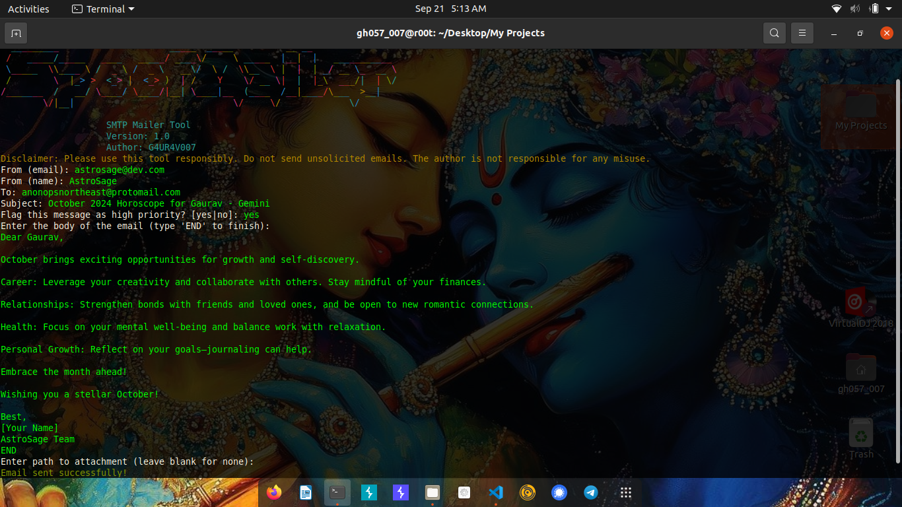

# SpoofMailer



SpoofMailer is a simple SMTP mailer tool that allows users to send emails with customizable fields, including the sender, recipient, subject, body, and attachments. Designed for ease of use, SpoofMailer also includes an ASCII banner and a disclaimer to ensure responsible usage.

## Features

- **Customizable SMTP Settings**: Easily configure your SMTP server settings.
- **Dynamic Email Fields**: Specify the sender, recipient, subject, and body of the email.
- **File Attachments**: Attach files to your emails.
- **ASCII Art Banner**: A visually appealing introduction to the tool.
- **Disclaimer**: Reminder to use the tool responsibly and avoid unsolicited emails.

## Prerequisites

- Python 3.x

## Requirements Installation

To run SpoofMailer, you need the `termcolor` library. You can install it using pip:

```bash
pip install termcolor
```

## Installation

1. **Clone the Repository**:
   ```bash
   git clone https://github.com/0xgh057r3c0n/SpoofMailer.git
   cd SpoofMailer
   ```

2. **Run the Tool**:
   ```bash
   python spoofmail.py
   ```

## SMTP Configuration

To configure your SMTP server, log in to your [Brevo account](https://www.brevo.com/) and obtain your SMTP server details, including:

- SMTP Host
- SMTP Port
- Username
- Password

## Usage

1. **Run the Script**:
   Execute the script in your terminal:
   ```bash
   python spoofmail.py
   ```

2. **Input SMTP Configuration**:
   When prompted, enter your SMTP host, port, username, and password obtained from Brevo.

3. **Specify Email Details**:
   - **From Address**: Enter the sender’s email address.
   - **From Name**: Enter the sender’s name.
   - **To Address**: Enter the recipient’s email address.
   - **Subject**: Enter the email subject.
   - **Body**: Type the body of the email line by line. Type `END` when finished.

4. **Attachment**: If you wish to attach a file, provide the path to the file.

5. **Send Email**: The script will attempt to send the email and display a success or failure message.

## Sample Output

When you run SpoofMailer, you will see an output similar to this:

```
  _________                     _____  _____         .__.__                
 /   _____/_____   ____   _____/ ____\/     \ _____  |__|  |   ___________ 
 \_____  \\____ \ /  _ \ /  _ \   __\/  \ /  \__  \ |  |  | _/ __ \_  __ \
 /        \  |_> >  <_> |  <_> )  | /    Y    \/ __ \|  |  |_\  ___/|  | \/
 /_______  /   __/ \____/ \____/|__| \____|__  (____  /__|____/\___  >__|   
         \/|__|                              \/     \/             \/       

                    SMTP Mailer Tool
                    Version: 1.0
                    Author: G4UR4V007
Disclaimer: Please use this tool responsibly. Do not send unsolicited emails. The author is not responsible for any misuse.

From (email): sender@example.com
From (name): Sender Name
To: recipient@example.com
Subject: Test Email
Flag this message as high priority? [yes|no]: yes
Enter the body of the email (type 'END' to finish):
This is the first line of the email.
This is the second line.
END
Enter path to attachment (leave blank for none): /path/to/attachment.txt

Email sent successfully!
```

## Disclaimer

⚠️ **Please use SpoofMailer responsibly.** Do not send unsolicited emails. The author is not responsible for any misuse of this tool.

## Contributing

Contributions are welcome! If you have suggestions or improvements, please create a pull request or open an issue.

## License

This project is licensed under the MIT License - see the [LICENSE](LICENSE) file for details.

## Author

**G4UR4V007**
